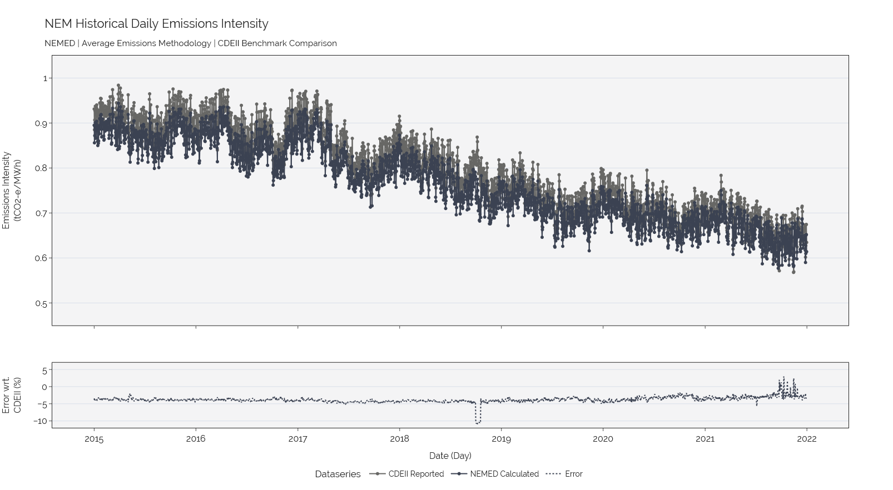

# NEMED

[](https://github.com/psf/black)
[](https://nemed.readthedocs.io/en/latest/?badge=latest)

NEMED[^1], or NEM Emissions Data, is a python package to retrieve and process historical emissions data of the National Electricity Market (NEM), reproduced by datasets published by the Australian Energy Market Operator (AEMO).

[^1]: Not to be confused with *"Nemed", "Nimeth"* of the [Irish legend](https://en.wikipedia.org/wiki/Nemed), who was the leader of the third group of people to settle in Ireland.

## Installation
```bash
pip install nemed
```

## Introduction

This tool is designed to allow users to retrieve historical NEM regional emissions data, either total or marginal emissions, for any 5-minute dispatch interval or aggregations thereof. Total emissions data produced by NEMED is given as both absolute total emissions (tCO2-e) and as an emissions intensity index (tCO2-e/MWh). Marginal emissions data reflects the price setter of a particular region, yielding an emissions intensity index (tCO2-e/MWh) corresponding to a particular plant.
Although data is published by AEMO via the [Carbon Dioxide Equivalent Intensity Index (CDEII) Procedure](https://www.aemo.com.au/energy-systems/electricity/national-electricity-market-nem/market-operations/settlements-and-payments/settlements/carbon-dioxide-equivalent-intensity-index) this only reflects a daily summary for each region by total and (average) emissions intensity.

### How does NEMED calculate emissions?
Total Emissions are computed by considering 5-minute generation dispatch data for each generator in the NEM for each respective region, along with their CO2-equivalent emissions factors per unit (generator) level. A detailed method of the process to produce results for total emissions(tCO2-e) and the corresponding emisssions intensities can be found [here](https://nemed.readthedocs.io/en/latest/method.html). The tool is able to provide these metrics on a dispatch interval basis, or aggregated to hourly, daily, monthly or yearly measures. For more advanced users, the emissions associated with each generator and hence that generator's contribution to total regional emissions can be extracted.

Marginal Emissions are computed by identifying the marginally dispatched generators from AEMO's Price Setter files, mapping emissions intensity metrics mentioned above and computing marginal emissions intensity (tCO2-e/MWh).

### How accurate is NEMED?
A series of [benchmark results](https://nemed.readthedocs.io/en/latest/examples/cdeii_benchmark.html) for total emissions shows a comparison between AEMO's daily CDEII reported emissions figures and NEMED's emissions figures which have been aggregated from a 5-minute dispatch-interval resolution to a daily basis.   

The [example](https://nemed.readthedocs.io/en/latest/examples/cdeii_benchmark.html) includes a region by region comparison for each metric, while an overview of the historical NEM Emissions Intensity produced using NEMED is shown here.


## Usage

### Examples
Examples can be found in [NEMED's documentation](https://nemed.readthedocs.io/en/latest/examples/total_emissions.html).

### Possible Use Cases
Some example use cases of data produced from this tool include:
- Analysis of historical emissions between NEM regions, generation technologies contributions to them and assessing the difference between total and marginal emissions.
- Using emissions intensities traces (total and marginal) from NEMED in counter-factual optimisation models; studying the influence of shadow-pricing carbon or imposing carbon constraints.
- Considering the emissions assosciated with grid-energy consumption for residential/C&I consumers, or in counterfactual studies of hypothetical EV usage or H2 electrolyser operation. 

## Contributing
Interested in contributing? Check out the [contributing guidelines](CONTRIBUTING.md), which also includes steps to install `NEMED` for development.

Please note that this project is released with a [Code of Conduct](CONDUCT.md). By contributing to this project, you agree to abide by its terms.

## License
`NEMED` was created by Declan Heim and Shayan Naderi. It is licensed under the terms of the `BSD 3-Clause license`.

## Credits
This package was created using the [`UNSW CEEM template`](https://github.com/UNSW-CEEM/ceem-python-template). It also adopts functionality from sister tools including [`NEMOSIS`](https://github.com/UNSW-CEEM/NEMOSIS) and [`NEMPY`](https://github.com/UNSW-CEEM/nempy).